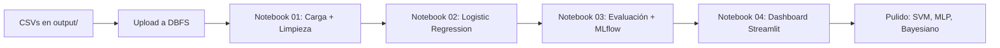

# Plan de Acción Técnico — Predictor de Videojuegos en Steam

**Stack:** Databricks Free Edition + PySpark / PySpark ML
**Anclado a:** `Documento Tecnico - Predictor de Videojuegos.md` (§3 Arquitectura, §4 Metodología ML, §6 Diccionario) y `VIDEO_GAMES_/VIDEO_GAMES_.md` (§5 Objetivos, §7 Marco Metodológico).

---

## 1. Stack y restricciones operativas

### 1.1 Plataforma: Databricks Free Edition

| Recurso | Disponible | Implicación de diseño |
| :--- | :--- | :--- |
| Compute | 1 clúster single-node (~15 GB RAM, ~2 vCPU) | Dataset cabe en memoria — Spark se usa por consistencia con la materia, no por escala. |
| Almacenamiento | DBFS (`/FileStore/`, `/dbfs/`) | Los 4 CSVs de `output/` se suben manualmente vía UI. |
| Jobs / Scheduler | No disponible | ETL se ejecuta local; el clúster solo entrena modelos. |
| Auto-termination | 2 h de inactividad | Persistir resultados intermedios a DBFS antes de pausas. |
| MLflow | Disponible | Registro de runs, métricas y modelos. |
| Delta Lake | Disponible | Usar para silver/gold; mantener bronze en CSV para portabilidad. |

### 1.2 Material de la materia ya cubierto (referencia directa al código de clase)

| Tema clase | Notebook de referencia | Reutilización en este proyecto |
| :--- | :--- | :--- |
| Regresión Logística (PySpark ML) | `1.3 Regresión logística (modelo básico).py` | Plantilla directa para baseline. Mismo patrón `VectorAssembler` → `LogisticRegression`. |
| Cross-entropy | `1.3.3 Cross entropy.py` | Función de pérdida implícita en `LogisticRegression`. No requiere código adicional. |
| Hiperparámetros | `1.5 Optimizacion por hiperparametros.py` | Patrón `ParamGridBuilder` + `CrossValidator` reutilizable. |
| SVM | `1.7 SVM.py` (`LinearSVC` con dataset de vinos) | Plantilla para clasificación SVM lineal — ver limitación RBF más abajo. |
| Bayesiano | `1.8 Modelo Bayesiano (red).py` | Plantilla para inferencia bayesiana — ver limitación PyMC más abajo. |
| Perceptrón simple | `2.1 Perceptron simple.py` | Antecedente teórico para MLP. |
| MLP | `2.2 MLP (Speed dating).py` | Plantilla directa para `MultilayerPerceptronClassifier`. |
| MLflow | `4.1 Redes Recurrentes y defensas/Defensa practica MLflow.py` | Patrón para `mlflow.log_metric`, `mlflow.spark.log_model`. |

---

## 2. Limitaciones técnicas conocidas (decisiones de diseño)

Estas son restricciones reales de las herramientas vistas en clase. El plan las asume desde el inicio.

| Componente | Limitación | Decisión |
| :--- | :--- | :--- |
| `pyspark.ml.classification.LinearSVC` | Solo kernel lineal. No soporta RBF nativamente. | Implementar SVM **lineal** sobre la matriz One-Hot. RBF queda como mejora futura vía `sklearn.svm.SVC` en un subset (<10k filas). |
| `pyspark.ml.classification.MultilayerPerceptronClassifier` | Solo activación Sigmoide entre capas (capa de salida Softmax). **No expone ReLU ni Tanh.** | Documentar como limitación. Para ReLU/Tanh estrictos haría falta TensorFlow/Keras — fuera del alcance MVP. |
| Modelos Bayesianos Jerárquicos (`PyMC`) | Ejecución en el driver del clúster (no distribuye). Lento con MCMC NUTS. | En Free Edition, **postergar a fase de pulido**. El baseline cubre el objetivo de clasificación. |
| Databricks Free Edition | Sin Jobs Scheduler. | El ETL se mantiene local (`steam_etl.py`); el notebook se ejecuta a demanda. |
| `hub_followers` como proxy de wishlists | Correlación validada por la industria (×7-10), no medida directa. | Reportar en el dashboard como "estimación", no como predicción exacta. |
| `owners_lower_bound` (target) | Es un rango estimado por SteamSpy, no ventas reales. | Binarizar con umbral 20.000 mitiga la imprecisión del valor exacto. |
| Reducción ~15k → ~6.5k registros útiles | Es comportamiento esperado del ETL (§4 Doc. Técnico). | No intentar "rescatar" filas; el dataset resultante es estadísticamente válido. |

---

## 3. Camino MVP (funcional primero, pulido después)

Objetivo: tener un **clasificador binario evaluado** y un **dashboard mínimo** funcionando antes de añadir SVM RBF, MLP profundo o Bayesianos.



### 3.1 MVP — Notebook 01: Ingesta y limpieza (`01_data_prep.py`)

1. Subir `output/games_metadata.csv`, `games_tags.csv`, `games_timeseries.csv` a `/FileStore/tables/steam/` desde la UI de Databricks.
2. Lectura en Spark:
   ```python
   meta = spark.read.csv("/FileStore/tables/steam/games_metadata.csv", sep=";", header=True, inferSchema=True)
   tags = spark.read.csv("/FileStore/tables/steam/games_tags.csv", sep=";", header=True, inferSchema=True)
   ```
3. Join por `appid`. Eliminar filas con `owners_lower_bound` nulo.
4. Imputación de mediana en `price`, `total_achievements`, `hub_followers` con `Imputer(strategy="median")`.
5. Crear target binario: `label = (owners_lower_bound > 20000).cast("int")`.
6. Persistir como Delta: `df.write.format("delta").mode("overwrite").save("/FileStore/tables/steam/features_silver")`.

### 3.2 MVP — Notebook 02: Baseline Logistic Regression (`02_logistic_regression.py`)

Plantilla directa de `1.3 Regresión logística (modelo básico).py`:

1. `VectorAssembler` sobre features numéricas + columnas booleanas de tags.
2. `StandardScaler` solo sobre numéricas de alta varianza (`price`, `hub_followers`, `total_achievements`).
3. Split 80/20 con `randomSplit([0.8, 0.2], seed=42)`.
4. Entrenar:
   ```python
   lr = LogisticRegression(featuresCol="features", labelCol="label", maxIter=50, regParam=0.01)
   model = lr.fit(train_df)
   ```
5. Extraer `model.coefficients` y `model.intercept` → guardar a Delta para alimentar el dashboard.

### 3.3 MVP — Notebook 03: Evaluación + tracking (`03_evaluation.py`)

1. `BinaryClassificationEvaluator(metricName="areaUnderROC")` sobre test set.
2. `MulticlassClassificationEvaluator(metricName="f1")` para F1-score.
3. Logging a MLflow (patrón de `Defensa practica MLflow.py`):
   ```python
   with mlflow.start_run(run_name="lr_baseline"):
       mlflow.log_param("regParam", 0.01)
       mlflow.log_metric("auc", auc)
       mlflow.log_metric("f1", f1)
       mlflow.spark.log_model(model, "model")
   ```
4. Cross-validation con 3 folds (no 5 para ahorrar tiempo en Free Edition):
   ```python
   cv = CrossValidator(estimator=lr, estimatorParamMaps=paramGrid, evaluator=evaluator, numFolds=3)
   ```

### 3.4 MVP — Notebook 04: Dashboard mínimo (`04_dashboard.py`)

Versión funcional, no estética:

1. Leer los coeficientes guardados por Notebook 02.
2. UI con `ipywidgets` dentro del notebook (más simple que Streamlit para Free Edition):
   - Sliders: `price`, `hub_followers`.
   - Checkboxes: top-10 tags más impactantes (mayor `|coeficiente|`).
3. Output: `P(éxito) = sigmoid(β·x + α)` recalculado on-change.
4. Recomendación dinámica: identificar el feature con mayor delta positivo al togglear → mensaje "Activar tag X aumenta la probabilidad en Y%".

**Criterio de "MVP terminado":** los 4 notebooks ejecutan E2E sin errores y producen un AUC > 0.65 en test. Eso valida el objetivo principal de §5.1 de VIDEO_GAMES_.

---

## 4. Pulido posterior (cuando el MVP esté validado)

Solo abordar tras tener el MVP funcionando.

### 4.1 SVM lineal (Notebook 05)
- `LinearSVC` con la misma matriz de features.
- Comparar AUC contra el baseline. Documentar la diferencia.

### 4.2 MLP (Notebook 06)
- `MultilayerPerceptronClassifier(layers=[N_features, 32, 16, 2], maxIter=100, seed=42)`.
- **Limitación documentada:** Sigmoide entre capas, no ReLU.
- Comparar AUC y tiempo de entrenamiento contra LR y SVM.

### 4.3 SVM RBF (Notebook 07, opcional)
- Si el dataset consolidado es <10.000 filas tras filtros, exportar a Pandas y usar `sklearn.svm.SVC(kernel="rbf")`.
- Si supera 10k, **omitir** — riesgo de OOM en Free Edition.

### 4.4 Bayesiano Jerárquico (Notebook 08, opcional)
- `PyMC` en driver, agrupando por `developer`.
- **Limitación documentada:** single-node, lento. Ejecutar sobre subset.
- Valor: shrinkage hacia la media global para estudios novatos (cumple §4.2.4 del Doc. Técnico).

### 4.5 Series temporales (`games_timeseries.csv`)
- Reindexación a calendario mensual completo desde `release_date`.
- `fillna(0)` en métricas mensuales.
- **No entrenar LSTM/RNN en MVP** — fuera de alcance dado el tiempo.

### 4.6 NLP (`games_text.csv`)
- `Tokenizer` + `HashingTF` + `IDF` sobre `short_description`.
- Concatenar al vector de features y reentrenar LR.
- Solo si los 4 notebooks anteriores convergen con tiempo de sobra.

---

## 5. Trazabilidad a objetivos específicos (VIDEO_GAMES_.md §5.2)

| Objetivo específico | Fase/Notebook que lo cubre |
| :--- | :--- |
| Dataset estructurado y confiable | ETL local ya ejecutado → CSVs en `output/`. |
| Validación bibliográfica | Marco teórico en `VIDEO_GAMES_.md` (no requiere código). |
| Identificación de variables críticas | Notebook 02 (coeficientes LR + odds ratios). |
| Limpieza de datos históricos | Notebook 01 (imputación, target binario, Delta silver). |
| Modelo de clasificación | Notebook 02 (LR baseline), Notebook 05 (SVM), Notebook 06 (MLP). |
| Evaluación con validación | Notebook 03 (CrossValidator, AUC, F1, MLflow). |

---

## 6. Riesgos y mitigaciones

| Riesgo | Mitigación |
| :--- | :--- |
| Auto-termination del clúster en Free Edition | Persistir a Delta tras cada notebook. Reanudar desde la última tabla guardada. |
| Dataset muy desbalanceado (pocos juegos exitosos) | Reportar matriz de confusión, no solo accuracy. Considerar `weightCol` en LR si la clase minoritaria es <20%. |
| Sobreajuste por alta dimensionalidad (50+ tags) | `regParam=0.01` con `elasticNetParam=0.5` (L1+L2). |
| Deriva temporal de `hub_followers` | Documentar en el dashboard que la estimación asume condiciones de mercado actuales. |
| Tiempo limitado | Detener en MVP (notebooks 01-04). Pulido solo si hay holgura. |

---

## 7. Orden de ejecución sugerido

1. **Día 1:** Subir CSVs a DBFS. Ejecutar Notebook 01 (carga + limpieza). Validar que `features_silver` está bien.
2. **Día 2:** Notebook 02 (LR) + Notebook 03 (evaluación + MLflow). Asegurar AUC > 0.65.
3. **Día 3:** Notebook 04 (dashboard ipywidgets). MVP completo.
4. **Día 4+:** Notebooks 05-08 según tiempo disponible.

El criterio de éxito del MVP es **funcionalidad E2E**, no precisión máxima. La precisión se mejora en la fase de pulido.
